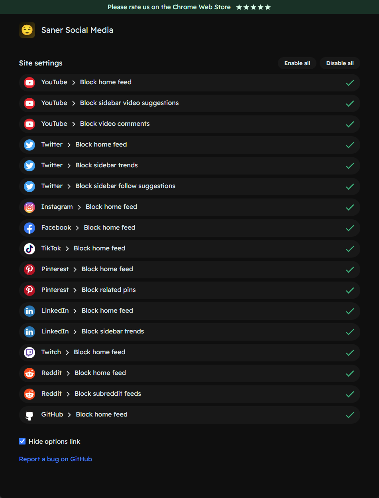
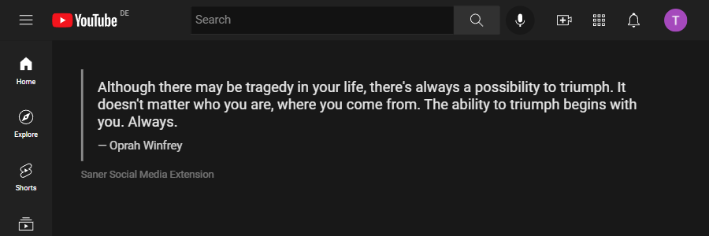
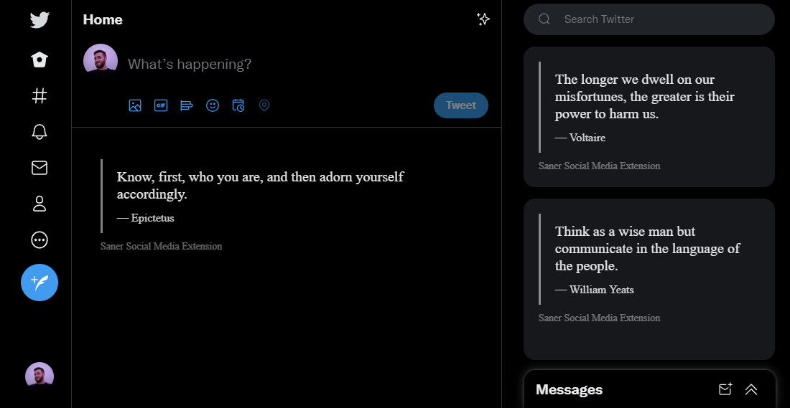

<h1 align="center">
  
   
  Saner Social Media
</h1>

  
  
  

Chrome extension for replacing addictive and annoying features of various social media sites with inspirational quotes.

- [Feature highlights & supported sites](#feature-highlights--supported-sites)
- [Support this project](#support-this-project)
- [Installation](#installation)
- [Development](#development)
- [Acknowledgements](#acknowledgements)

## Feature highlights & supported sites

- Support for YouTube
  - Hide feed on home page
  - Hide related videos in sidebar on video page
  - Hide comments on video page
- Support for Twitter
  - Hide feed on home page
  - Hide trends in sidebar
  - Hide follow suggestions in sidebar
- Support for Instagram
  - Hide feed on home page
- Support for Facebook
  - Hide feed on home page
- Support for TikTok
  - Hide feed on home page
- Support for Pinterest
  - Hide feed on home page
  - Hide related pins
- Support for LinkedIn
  - Hide feed on home page
  - Hide trending news in sidebar
- Support for Twitch
  - Hide feed on home page
- Support for Reddit
  - Hide feed on home page
- Support for GitHub
  - Hide feed on home page
- 1600+ inspirational quotes
- Works with dark and light themes

## Support this project

Please consider to support this free and open source project.

- Tell your friends
- Visit the [Chrome Web Store](https://chrome.google.com/webstore/detail/saner-social-media/opnoobcmpioggidgaejfkbopdphbfkkk) and write a review
- Star us on GitHub
- Report bugs on [GitHub](https://github.com/tobidalhof/sanersocialmedia/issues)

## Installation

**Option 1** – Install from [Chrome Web Store](https://chrome.google.com/webstore/detail/saner-social-media/opnoobcmpioggidgaejfkbopdphbfkkk)

**Option 2** – Install from GitHub release:

- Navigate to [releases](https://github.com/tobidalhof/sanersocialmedia/releases)
- Download `extension.zip` of your preferred release
- Unzip `extension.zip`
- Open `chrome://extensions/` in Chrome
  - Enable `Developer mode`
  - Click `Load unpacked` and select the unzipped `extension` directory

## Development

- Clone this repo
- Install dependencies with `pnpm install`
- Start dev watchers with `pnpm dev`
- Open `chrome://extensions/` in Chrome
  - Enable `Developer mode`
  - Click `Load unpacked` and select the `extension` directory

Note: HMR for the options page is [not possible yet](https://github.com/antfu/vitesse-webext/issues/59#issuecomment-1011008367). 

## Acknowledgements

Special thanks goes to [@jordwest](https://github.com/jordwest) for creating [News Feed Eradicator](https://github.com/jordwest/news-feed-eradicator) which obviously was a big inspiration for me. I created this extension to add support for more social media sites.
